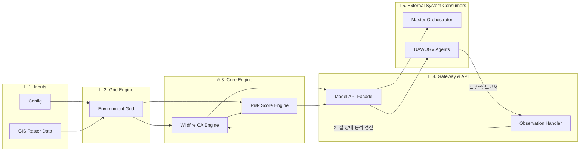

# 🌲 Wildfire Multi-Agent Environmental Modeling Subsystem
> **산불 다중 에이전트 대응 시뮬레이션 — 환경 및 산불 모델 (Environment & Wildfire Model)**

본 모듈은 **Multi-Agent Wildfire Response Simulation Environment** 프로젝트의 하위 시스템으로, 실제 지형 GIS(GeoTIFF)  raster 데이터를 불러오고, 지형·식생·기상 정보를 반영한 2D 격자(Grid)를 생성, Rothermel 표면 확산 모델 바탕의 **Cellular Automata(CA) 산불 확산 시뮬레이션**, **실시간 화재 위험도(Risk Score) 산출**, 그리고 드론(UAV)·지상로봇(UGV)의 **현장 관측 정보 동적 반영 기능**을 제공한다.

---

## 📌 목차 (Table of Contents)
1. [💡 프로젝트 개요 (Overview)](#-프로젝트-개요-overview)
2. [🔄 환경 모델 전체 흐름도 (Workflow & Architecture)](#-환경-모델-전체-흐름도-workflow--architecture)
3. [🔥 Cellular Automata (CA) 산불 확산 수식 및 원리](#-cellular-automata-ca-산불-확산-수식-및-원리)
4. [⚠️ Dynamic Risk Scoring (위험도 산출 공식)](#️-dynamic-risk-scoring-위험도-산출-공식)
5. [🔌 Public API & 시스템 통합 규격 (Facade API)](#-public-api--시스템-통합-규격-facade-api)
6. [📁 디렉터리 구조 (Directory Structure)](#-디렉터리-구조-directory-structure)
7. [🛠️ 개발 환경 및 주요 라이브러리 (Tech Stack)](#️-개발-환경-및-주요-라이브러리-tech-stack)
8. [🚀 Integrated GIS Visualization 실행 방법](#-integrated-gis-visualization-실행-방법)

---

## 💡 프로젝트 개요 (Overview)

### 산불 환경 모델링의 목적과 역할
본 환경 모델의 주 목적은 단순히 특정 지역의 산불을 가상 예측하는 것에 그치지 않고, **총괄 오케스트레이터(Master Orchestrator)의 자원 배치 및 재할당 판단**과 **UAV/UGV 에이전트의 접근성 판별**을 가능하게 만드는 **동적 환경 상태(State Space)를 제공**하는 것이다.

* **지형 및 도로망 반영**: 능선 및 경사도로 인한 UGV 지상 자원의 우회 경로 판별 및 도로망 차단 여부 평가
* **기상 변수 결합**: 풍향 및 풍속 변화에 따른 실시간 화재 확산 방향 및 위험지역(Downwind Risk Area) 동적 계산
* **이종 자원 접근성 차이**: UAV(공중)와 UGV(지상)가 체감하는 접근 제한 요소(경사, 고도, 도로 유무) 분리 제공
* **현장 관측 갱신 (Closed-Loop Update)**: UAV/UGV가 전달한 정밀 관측 정보(`ObservationReport`)를 수용하여 환경 격자의 상태와 위험도를 실시간으로 재계산

---

## 🔄 환경 모델 전체 흐름도

아래 파이프라인은 공간 raster 데이터 입력부터 2D 셀 격자 ingestion, 산불 확산 계산, 위험도 산출, 현장 관측 갱신, 그리고 외부 API 연동까지의 데이터 흐름을 나타낸다.



---

## 🔥 Cellular Automata (CA) 산불 확산 수식 및 원리

셀룰러 오토마톤(Cellular Automaton)은 격자 형태의 공간에서 각 세포(Cell)가 주변 세포들의 상태에 따라 정해진 규칙에 맞춰 동시에 자신의 상태를 변화시켜 나가는 계산 모델이다. 산불 확산 엔진(`WildfireCAEngine`)은 discrete time-step Cellular Automata 방식을 사용하며, 각 셀은 `UNBURNED`, `BURNING`, `BURNED` 3가지 상태를 거친다.

### 1. 셀 상태 전이 (State Lifecycle)

```text
                           확률적 발화                         연소 완료   
          [UNBURNED] ---------------------> [BURNING] ---------------------> [BURNED]
                      확산 확률 P_combined               지정 지속 시간 T_burn
```

* **BURNING**: 연소 중인 상태로 주변 `UNBURNED` 셀로 불꽃을 확산시킴.
* **BURNED**: 설정 파일(`burn_duration_steps`, 현재 기본값: 5 step)에 지정된 기간이 지나면 숯/재 상태로 전이되어 더 이상 연소하지도 확산시키지도 않음.

### 2. 이웃 셀 확산 확률 수식 (Pairwise Spread Probability)
연소 중인 셀 $S$(Source)로부터 미연소 이웃 셀 $T$(Target)로 산불이 번질 확률 $P(S \to T)$는 Rothermel 표면 확산 모델의 물리적 인자를 정규화하여 산출한다:

$$P(S \to T) = P_{\text{base}} \cdot f_{\text{fuel}}(T) \cdot f_{\text{moisture}}(T) \cdot f_{\text{slope}}(S, T) \cdot f_{\text{wind}}(S, T)$$

* **기본 확산 확률 ($P_{\text{base}}$)**: `fire_ca.base_spread_probability` (기본값: $0.40$)
* **연료 가중치 ($f_{\text{fuel}}$)**: Target 셀의 물리적 연료량 (`fuel_amount` $\in [0.0, 1.0]$). 연료가 $0.0$인 미연소/도로/수역 셀은 확산 확률이 $0$이 된다.
* **습도 감쇄 인자 ($f_{\text{moisture}}$)**:

$$f_{\text{moisture}}(T) = \max\left(0.0, 1.0 - w_{\text{moisture}} \cdot \text{moisture}_T\right)$$

* **경사 보정 인자 ($f_{\text{slope}}$)**: 고도 차이 $\Delta z = z_T - z_S$와 평면/공간 거리를 이용한 Gradient 지수 보정 (오르막 $\Delta z > 0$ 확산 촉진, 내리막 $\Delta z < 0$ 확산 억제):
  
$$f_{\text{slope}}(S, T) = \exp\left(w_{\text{slope}} \cdot \frac{z_T - z_S}{d(S, T)}\right)$$

* **바람 지향성 보정 인자 ($f_{\text{wind}}$)**: 풍속 $v_{\text{wind}}$와 확산 방향 벡터 $\hat{u}_ {S \to T}$, 바람이 불어가는 방향 벡터 $\hat{w}_{\text{towards}}$ 간의 내적(Dot Product) 일치도 alignment 보정:

$$f_{\text{wind}}(S, T) = 
\exp\left(
w_{\text{wind}}
\cdot
v_{\text{wind}}
\cdot
\left(
\hat{u}_{S \to T}
\cdot
\hat{w}_{\text{towards}}
\right)
\right)
$$

### 3. 다중 이웃 연소 셀에 의한 결합 확산 확률 (Combined Ignition Probability)
Target 셀 $T$가 주변의 여러 연소 셀 $\{S_1, S_2, \dots, S_k\}$로부터 동시에 열을 받는 경우, 어느 한 셀로부터도 발화되지 않을 확률의 여집합으로 결합 발화 확률을 계산한다:

$$P_{\text{combined}}(T) = 1.0 - \prod_{i=1}^{k} \left(1.0 - P(S_i \to T)\right)$$

RNG(Random Number Generator) 난수 시드(`seed`)로 `roll < P_combined` 조건을 평가하여 발화를 결정한다.

---

## ⚠️ 위험도 산출 공식

`src/environment/risk.py` 모듈은 오케스트레이터의 자원 배치 우선순위 결정을 위해 각 셀별 위험도(`risk_score` $\in [0.0, 1.0]$)를 계산한다.

$$\text{risk}_{\text{score}}(T) = \begin{cases} 
1.0 & \text{if } \text{fire}_{\text{state}} = \text{BURNING} \\
0.2 & \text{if } \text{fire}_{\text{state}} = \text{BURNED} \\
\max\left(0.0, \min\left(1.0, S_{\text{base}} + S_{\text{slope}} + S_{\text{fuel}} + S_{\text{downwind}}\right)\right) & \text{if } \text{fire}_{\text{state}} = \text{UNBURNED}
\end{cases}$$

### UNBURNED 셀 가중치 성분
1. **경사 위험도 ($S_{\text{slope}}$)**: $w_{\text{slope}} \cdot \min\left(1.0, \frac{\text{slope}}{\text{max}_{\text{slope}}}\right)$
2. **연료 위험도 ($S_{\text{fuel}}$)**: $w_{\text{fuel}} \cdot \text{fuel}_{\text{amount}}$
3. **풍하측 화재 근접 위험도 ($S_{\text{downwind}}$)**: 현재 연소 셀로부터 `downwind_buffer_cells` 반경 이내에 존재하고, 바람 벡터 진행 방향의 전방 각도(`downwind_dot_threshold` $> 0.3$) 내에 포함된 셀일 경우 $+ w_{\text{downwind}}$ 추가 부여.

---

## 🔌 Public API & 시스템 통합 규격 (Facade API)

`EnvironmentModelAPI` (`src/environment/api.py`) 클래스는 다른 서브시스템(오케스트레이터, UAV, UGV, 통합 파트)이 환경 모델을 제어하고 조회할 수 있는 단일 창구 역할을 제공한다.

| API 메서드 | 설명 | 반환/영향 타입 |
| :--- | :--- | :--- |
| `get_fire_locations()` | 현재 활성 연소 중인 `BURNING` 셀의 위치 및 식별자 반환 | `List[Dict[str, Any]]` |
| `get_fire_perimeter()` | 미연소 지형과 접해 있는 화재 외곽 경계 셀 리스트 산출 | `List[Dict[str, Any]]` |
| `get_risk_map()` | 전체 격자의 `cell_id` $\to$ `risk_score` 매핑 딕셔너리 반환 | `Dict[int, float]` |
| `get_spread_direction()` | 현재 바람 설정 기반의 예측 확산 방향 및 방위각 반환 | `Dict[str, Any]` |
| `get_environment_state()` | 상태 버전(`state_version`), 시간인출, 셀 카운트 등 메타데이터 반환 | `Dict[str, Any]` |
| `apply_observation(report)` | UAV/UGV의 현장 관측 보고서 반영 및 위험도 자동 재계산 | `Dict[str, Any]` |
| `step()` | CA 시뮬레이션 1 단계(Step) 진행 및 새로 발화된 셀 리스트 반환 | `List[Cell]` |

---

## 📁 디렉터리 구조 (Directory Structure)

본 프로젝트의 환경 모델 관련 핵심 소스 코드, 설정 파일, 데이터 및 테스트 디렉터리 구조이다.

```text
environmental-modeling/
├── config/
│   └── environment_config.yaml      # 공간, 식생 매핑, 바람, CA 확산, Risk 수식 통합 설정
├── data/
│   ├── raw/                         # 원본 unedited GIS 데이터 (DEM, 도로, 임상도 등 - Immutable)
│   └── processed/                   # 정제 및 좌표 동기화된 래스터/벡터 데이터
│       ├── dem_clipped.tif          # 고도 래스터 (DEM, EPSG:5186)
│       ├── slope_5186.tif           # 경사도 래스터
│       ├── aspect_5186.tif          # 향(Aspect) 래스터
│       ├── fuel_type.tif            # 토지피복/식생 피복 유형 래스터
│       ├── roads_raster.tif         # 도로망 래스터
│       └── hillshade.tif            # 음영기복 래스터 Overlay용
├── src/
│   └── environment/                 # 환경 및 산불 모델 핵심 소스 모듈
│       ├── __init__.py
│       ├── api.py                   # Public API Gateway Facade (EnvironmentModelAPI)
│       ├── cell.py                  # Cell 데이터 클래스 & FireState Enum 정의
│       ├── fire_model.py            # Rothermel 수식 기반 WildfireCAEngine
│       ├── grid.py                  # Rasterio 기반 raster 데이터 읽기 및 2D 격자 생성
│       ├── observation.py           # UAV/UGV 관측 보고서(ObservationReport) 반영기
│       └── risk.py                  # Dynamic Risk Scoring 연산 모듈
├── images/                          # 시각화 gif 파일 저장
├── visualize_fire.py                # 6-Layer 통합 GIS 시각화 및 애니메이션 실행 도구
└── README.md                        # 본 환경 모델 시스템 통합 안내서
```

---

## 🛠️ 개발 환경 및 주요 라이브러리 (Tech Stack)

* **언어 (Language)**: Python 3.10+ (권장: Python 3.12)
* **공간 데이터 및 래스터 처리 (GIS & Spatial Analytics)**:
  * `rasterio` (v1.3+): GeoTIFF 래스터 파일 읽기, 좌표계 변환, Spatial Affine Transform 관리
  * `geopandas` (v0.14+): Vector 공간 데이터 처리 및 좌표 재투영
  * `numpy` (v1.26+): 2D 격자 데이터 매트릭스 연산 및 난수 시드(`Generator`) 관리
* **시각화 및 애니메이션 (Visualization)**:
  * `matplotlib` (v3.8+): Multi-layer GIS Overlay, Colorbar, HUD UI 및 애니메이션 GIF 생성
* **설정 및 검증 (Config & Testing)**:
  * `pyyaml`: YAML 설정 파일 불러오기
  * `pytest` (v8.0+): 자동화 유닛 및 수면 검증 테스트

---

## 🚀 Integrated GIS Visualization 실행 방법

`visualize_fire.py` 스크립트는 래스터 지형, 음영 기복, 식생, 도로망, 119 안전센터 및 산불 확산 레이어를 한눈에 시각화하고 애니메이션 파일(.gif)로 저장할 수 있는 통합 도구이다.

### 기본 실행 명령
```bash
python visualize_fire.py --x 19 --y 142 --steps 30
```

### CLI 주요 매개변수 옵션 (CLI Arguments)

| 옵션 플래그 | 타입 | 기본값 | 설명 |
| :--- | :--- | :--- | :--- |
| `--config` | `str` | `config/environment_config.yaml` | 시스템 YAML 설정 파일 경로 지정 |
| `--seed` | `int` | `42` | 확산 난수 시드 (동일 시드 입력 시 100% 동일 확산 실행) |
| `--x` | `int` | *Grid 중앙* | 초기 산불 발화 셀의 열(Column) 인덱스 |
| `--y` | `int` | *Grid 중앙* | 초기 산불 발화 셀의 행(Row) 인덱스 |
| `--steps` | `int` | `30` | 시뮬레이션을 진행할 총 타임스텝 수 |
| `--interval` | `int` | `200` | 애니메이션 프레임 간격 (ms) |
| `--save` | `str` | `None` | 애니메이션 결과 저장 파일 경로 (예: `output.gif`) |
| `--fps` | `int` | `5` | 저장되는 애니메이션 GIF 프레임 속도 (FPS) |

### 실행 예시

#### 1. 특정 발화점 지정 및 30 Step 저장
```bash
python visualize_fire.py --x 120 --y 80 --steps 30 --save fire_simulation.gif --fps 5
```

#### 2. 시드값을 변경하여 재현성 비교 테스트
```bash
python visualize_fire.py --seed 1004 --steps 40 --interval 100
```

## 📚 참고 문헌

1. Karafyllidis, I., & Thanailakis, A. (1997). *A model for predicting forest fire spreading using cellular automata*. Democritus University of Thrace, Department of Electrical and Computer Engineering, Greece.

2. Alexandridis, A., Vakalis, D., Siettos, C. I., & Bafas, G. V. (2008). *A cellular automata model for forest fire spread prediction: The case of the wildfire that swept through Spetses Island in 1990*. Applied Mathematics and Computation, 204(1), 191–199.

3. Clarke, K. C., Brass, J. A., & Riggan, P. J. (1994). *A cellular automaton model of wildfire propagation and extinction*. Photogrammetric Engineering & Remote Sensing, 60(11), 1355–1367.

4. Andrews, P. L. (2018). *The Rothermel surface fire spread model and associated developments: A comprehensive explanation*. General Technical Report RMRS-GTR-371, U.S. Department of Agriculture, Forest Service, Rocky Mountain Research Station.