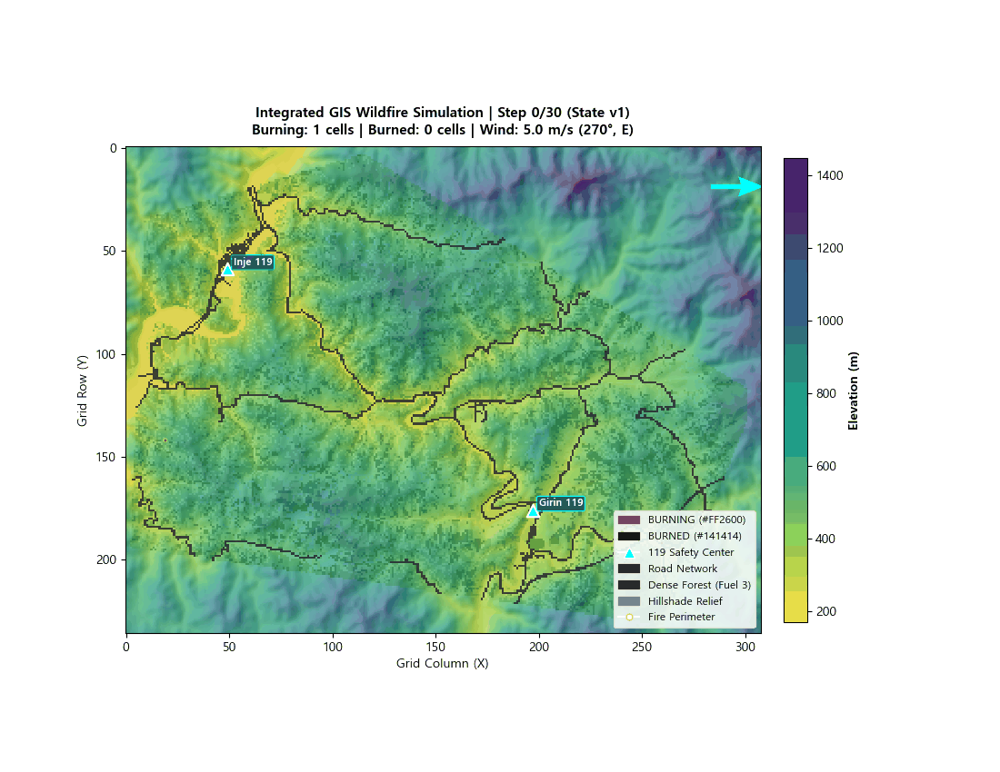

# 환경 모델링 파트 중간 보고서

* **작성자**: 환경 모델 담당
* **일시**: 2026년 9월 21일
* **참고자료**: [README.md](./README.md)

---

## 1. 담당 작업
- **전체 시스템에서의 역할**: 환경 / 산불 모델링
- **핵심 역할 및 구현 방식**:
  - **GIS 2D 환경 격자 구축 (`src/environment/grid.py`)**: 인제 원통-기린 지역 등 실제 GIS raster 데이터(`dem_clipped.tif`, `slope_5186.tif`, `aspect_5186.tif`, `fuel_type.tif`, `roads_raster.tif`)를 입력 처리하여 90m 셀 해상도의 2D `EnvironmentGrid` 생성.
  - **Cellular Automata 산불 확산 엔진 (`src/environment/fire_model.py`)**: Rothermel 표면 확산 모델의 영향을 반영한 확산 확률 기반 CA 엔진으로, 지형(경사), 기상(풍향/풍속), 식생(연료량), 습도를 반영하여 `UNBURNED -> BURNING -> BURNED` 상태 전이를 계산.
  - **위험도 산출 (`src/environment/risk.py`)**: 화재 상태, Downwind 유효 범위, 경사도 및 연료량 등을 조합해 셀 단위 `risk_score`를 계산.
  - **외부 연동 API 및 현장 관측 반영 (`src/environment/api.py`, `observation.py`)**: 총괄 Orchestrator, UAV/UGV 및 통합 시스템 연동용 `EnvironmentModelAPI` 제공 및 외부 관측 보고서(`ObservationReport`)를 입력받아 화재 상태/바람/습도 값을 모델에 반영할 수 있도록 구성.

---

## 2. 현재 진행 상황

- **완료 및 구현 중**: GIS 격자 구축, CA 산불 확산 엔진 초안, 위험도 산출, 환경 조회/API
  - **좌표계 / 격자 기준**:
    - 좌표계 (CRS): `EPSG:5186`
    - 격자 해상도: `90m / cell`
    - 격자 원점: `(298096.0, 591533.0)`
    - 격자 좌표계는 `+x = east`, `+y = south(row 증가 방향)` 기준 사용
- **진행 필요**: 입력 GIS raster 데이터 품질 재확인; Gazebo 3D·Web UI 연동용 좌표 변환 정리; 외부 시스템 연동을 위한 payload 스키마 및 출력 포맷 점검
- **임시 값**: (`config/environment_config.yaml`)
  1. 연료량 변환 기준 (`fuel_mapping`): 토지피복(`fuel_type` 0~3) → 물리적 연료량(0.0~1.0) 가중치는 현재 임시 가정값 사용.
  2. 위험도 산출 수식 (`risk_scoring`): `risk_score` 계산 기준(downwind buffer, slope weight 등)은 임시 시나리오 수식으로 구성; 총괄/통합 파트와 최종 표준 규격 협의 필요.
  3. 기초 기상 조건: 실시간 기상 API 미연동 상태로, 현재는 풍속 5m/s, 서풍(270°), 습도 0.2 등 시나리오 설정값 사용.

---

## 3. 연결할 내용
- **다른 파트에서 받아야 할 정보 (Inputs)**:
  - **UAV / UGV**: 현장 수색/대응 시 관측한 정밀 화재 좌표, 화재 상태(`BURNING`/`UNBURNED`), 풍속/풍향, 관측 보고서 (`ObservationReport`).
  - **시스템 통합**: Web 관제 UI / Gazebo 3D 연동용 공통 좌표계 기준점 및 메시지 payload 표준 스키마 (JSON/Protobuf).
- **다른 파트에 제공할 결과 (Outputs)**:
  - **총괄 Orchestrator**: 활성 화재 위치 (`get_fire_locations`), 화재 외곽 경계 (`get_fire_perimeter`), 예측 확산 방향 벡터 (`get_spread_direction`), 셀별 위험도 맵 (`get_risk_map`).
  - **UGV**: 산불 확산 및 위험 지역 차단 경로 판별용 도로망 raster 레이어 및 위험도 맵.

---

## 4. 막힌 점 & 멘토 질의사항
- **현재 상태**:
  - 핵심 환경 모델 기능(GIS 격자, CA 확산, 위험도 산출)은 초기 구현 상태이며, 현재는 통합 점검과 입력 데이터 품질 점검 단계에 있음.

- **멘토 질의사항**:
  1. GIS 입력 데이터 품질 검증: 현재 GIS 입력 데이터 검증 범위가 시뮬레이션용으로 충분한지. 현재 DEM, slope, aspect, fuel, roads raster를 동일 shape/CRS/transform 기준으로 정렬 검증하여 격자화했는데, 산불 확산 시뮬레이션 입력 데이터로서 추가로 우선 점검해야 할 품질 항목(예: 해상도 적정성, nodata 처리, 연료 분류 신뢰도, 경사도 정확도 등)이 있는지.
  2. 현재 `risk_score`는 최종 표준 합의 전까지 시나리오 기반 임시 수식을 쓰고 있는데 시연 단계에서는 "설명 가능하고 입력 변화에 일관되게 반응하는지" 수준의 검증으로 충분한지, 아니면 추가적인 정량 사례 비교가 필요한지.

---

## 5. 다음 계획 및 도움
- **다음 계획**:
  - GIS 데이터 품질 점검
  - 관측 반영 API 테스트 (화재 상태, 풍향/풍속, 셀 단위 습도)
  - 풍향/풍속 변화에 따른 위험도 및 확산 방향 변화 검증

- **도움이 필요한 부분**:
  - Web UI / Gazebo에서 사용할 공통 좌표계 기준점, 축 방향, 단위 체계; 환경 모델 API 결과를 수신할 payload 스키마(JSON/Protobuf) 협의
  - UAV/UGV 관측 보고 예시 데이터; 풍향/풍속/습도 관측값의 전달 주기 및 필수 필드 협의

---

## 실행 화면

```bash
$ python visualize_fire.py --x 19 --y 142 --steps 30 --save images/fire_spread.gif
```


